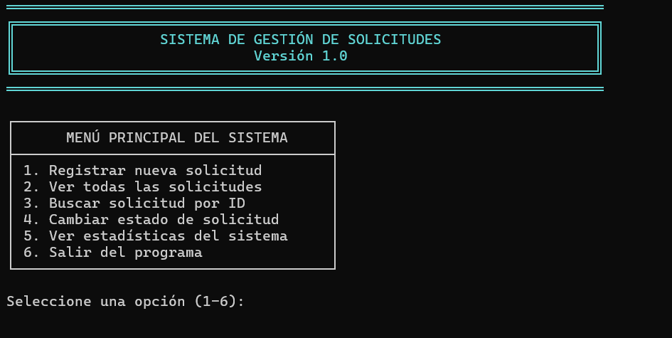
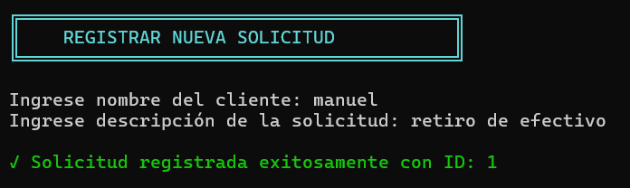
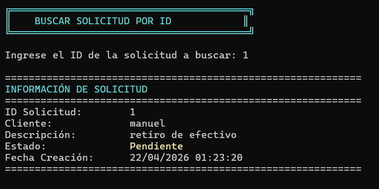
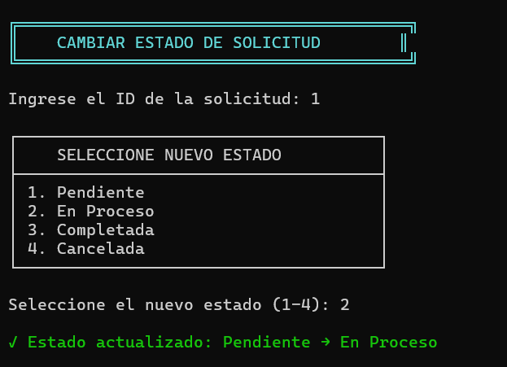
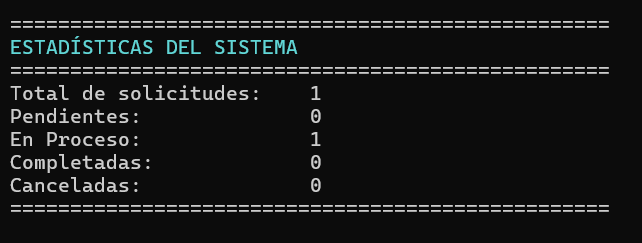

# Sistema de Gestión de Solicitudes

## 📌 Descripción del Proyecto

Este es proyecto de sistema de gestión de solicitudes de clientes para servicios.  
Que permite registrar, consultar, actualizar y analizar solicitudes.

El sistema utiliza estructuras como clases, enumeradores, listas y manipular los datos de forma eficiente.

## 🧩 Estructura del Programa

### 🔹 Enumerador

#### `EstadoSolicitud`

Define los estados posibles de una solicitud:

- `Pendiente` → Solicitud registrada
- `EnProceso` → Solicitud en atención
- `Completada` → Finalizada correctamente
- `Cancelada` → Cancelada por el usuario o sistema

---

### 🔹 Clase Principal

#### `Solicitud`

Representa una solicitud individual dentro del sistema.

**Atributos:**
- `Id`
- `Nombre`
- `Descripcion`
- `Estado`
- `FechaCreacion`
- `FechaActualizacion`

**Métodos:**
- `MostrarInformacion()` → Muestra todos los datos de la solicitud
- `CambiarEstado(EstadoSolicitud)` → Actualiza el estado
- `ObtenerEstadoTexto()` → Devuelve el estado en formato texto

---

### 🔹 Clase Gestora

#### `GestorSolicitudes`

Encargada de administrar todas las solicitudes.

**Atributos:**
- `List<Solicitud> solicitudes`
- `int proximoId`

**Métodos:**
- `RegistrarSolicitud(nombre, descripcion)`
- `MostrarTodasLasSolicitudes()`
- `BuscarPorId(id)`
- `CambiarEstadoSolicitud(id, estado)`
- `MostrarEstadisticas()`
- `ObtenerTotalSolicitudes()`

---

### 🔹 Programa Principal

#### `Program`

Controla la ejecución del sistema mediante un menú interactivo.

**Opciones disponibles:**
1. Registrar nueva solicitud  
2. Ver todas las solicitudes  
3. Buscar solicitud por ID  
4. Cambiar estado de solicitud  
5. Ver estadísticas  
6. Salir  

---

### 🔹 Extensión

#### `StringExtensions`

Método auxiliar:

- `PadBoth(int length)` → Centra texto en consola

---

## 🖥️ Funcionamiento del Sistema

El programa funciona en un bucle interactivo donde el usuario selecciona opciones desde un menú.

### Flujo básico:

1. El usuario registra una solicitud
2. El sistema asigna automáticamente un ID
3. Puede consultar o modificar el estado
4. Se pueden visualizar estadísticas en tiempo real

---

## 📊 Estadísticas

El sistema calcula dinámicamente:

- Total de solicitudes
- Cantidad por estado:
  - Pendientes
  - En proceso
  - Completadas
  - Canceladas

## 📷 Capturas de Pantalla

### 🧾 Menú principal

### 📝 Registro de solicitud

### 🔍 Búsqueda de solicitud

### 🔄 Cambio de estado

### 📊 Estadísticas

